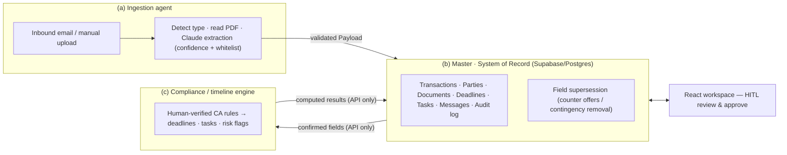

# Terra — AI Transaction Coordinator for California Real Estate

Terra is an AI-powered workspace that helps a real-estate **transaction
coordinator** run a residential deal from contract to close. It reads the deal's
signed documents, extracts the terms, computes the California contingency
timeline, tracks every party and task, and drafts the follow-ups — while keeping
a human in control of every consequential action.

The guiding principle: **don't just organize the transaction — help execute it.**
Instead of another folder-and-checklist tool, Terra identifies what needs to
happen next, prepares the work, and asks the coordinator to review and approve.

> Status: working MVP on synthetic data. Full-stack (FastAPI · React/TypeScript ·
> Supabase/Postgres), real document extraction via Claude, and **387 passing
> backend tests**. California residential only.

<!--
  SCREENSHOTS — highly recommended for a portfolio README.
  Add 2–3 images or a short GIF of: the Today command-center, a deal workspace
  (Deal Map + timeline), and the extraction-review screen. Then reference them:
    
-->

---

## Why it's interesting (engineering highlights)

- **Decoupled "payloads-only" architecture.** Three parts — ingestion, the
  system-of-record, and the compliance/timeline engine — communicate *only*
  through a validated `Payload` contract. No part reads another's database or
  imports its internals. Cross-component access is a stop-the-line violation.
- **Real document understanding, human-verified.** Signed PDFs are read with
  Claude (structured JSON output, per-field confidence, a strict field
  whitelist). Nothing enters the record until the coordinator confirms it (HITL).
- **A multi-document pipeline that reconciles itself.** Purchase agreements,
  **counter offers**, and **contingency-removal** forms are cross-checked and can
  *supersede* each other: a seller counter's price overrides the PA (with
  provenance — "$1.9M, was $1.8M"), and a contingency-removal form drops the
  corresponding deadlines off the timeline.
- **A compliance engine that refuses to guess.** California contingency
  deadlines are computed from a **human-verified** ruleset; the service
  hard-stops until a person verifies the numbers. Weekend/holiday date math,
  seven risk-flag cases, and draft reminders are all covered by tests against a
  synthetic ruleset.
- **Security & auditability built in.** Supabase row-level security with scoped
  party access tokens, TC sessions gated on TOTP MFA (`aal2`), an append-only
  audit log enforced by a DB trigger, and a zero-data-retention gate on every AI
  call.
- **Safety guardrails as first-class code** (see the five hard rules below) — no
  auto-send, no wiring/payment data, and a copyrighted-forms boundary.

---

## Architecture



**(a) Ingestion** watches a dedicated inbound email address (Postmark) and a
manual-upload fallback, detects document type and readability, extracts fields,
and emits a validated Payload. It never writes the record directly.

**(b) Master / System of Record** is the Supabase-backed source of truth. It
consumes Payloads *after* the coordinator confirms them, enforces RLS and the
append-only audit log, resolves cross-document supersession, derives parties, and
gates the timeline until every deadline-driving field is confirmed.

**(c) Compliance / timeline engine** runs on an interval, reads confirmed fields
through the master's API, and computes deadlines, tasks, and risk flags from
verified CA rules — never touching the master's tables directly.

More detail: [`rules/architecture.md`](rules/architecture.md),
[`rules/data-model.md`](rules/data-model.md), [`rules/security.md`](rules/security.md).

---

## The five hard rules (safety by design)

These are enforced in code, not just documented:

1. **Only ingest the customer's own signed contract** — never generate, host, or
   pre-fill blank copyrighted C.A.R. forms.
2. **Never touch money movement or wiring instructions** — wire fraud is the top
   loss vector in closings; a field whitelist keeps payment data out entirely.
3. **A human approves every outbound message — no auto-send, ever.**
4. **California residential only** — one jurisdiction's forms and deadline rules,
   done correctly, first.
5. **Any AI model that sees the documents runs no-train / no-retain** — enforced
   by a zero-data-retention gate that blocks extraction unless confirmed.

---

## What it does, end to end

1. A signed document arrives (email or upload). Ingestion detects its type and,
   for a purchase agreement, extracts the §5 fields with confidence scores.
2. The coordinator reviews the extraction and confirms it (HITL). The deal is
   created; the California **contingency timeline** is computed.
3. Follow-on documents refine the deal:
   - **Counter offers** supersede terms (e.g. a new purchase price) and raise
     flags when the accepting party didn't sign in time, or when a further
     counter is pending.
   - **Contingency-removal (CR-B)** forms remove contingencies — the matching
     deadlines drop off the timeline.
4. The workspace surfaces what needs attention: a daily command center, a
   multi-lane deal map, parties and tasks, and AI-drafted messages that always
   require a human **Approve & Send**.

---

## Tech stack

| Layer | Choices |
|---|---|
| Backend | Python · FastAPI · Pydantic · Uvicorn |
| Data | Supabase (Postgres + Auth + Storage), row-level security, SQL migrations |
| AI | Anthropic Claude (structured JSON extraction, per-field confidence) |
| Docs | `pypdf` pre-check + decryption |
| Frontend | React 18 · TypeScript · Vite · framer-motion |
| Auth | Supabase JWT (JWKS/HS256), TOTP MFA (`aal2`), scoped party tokens |
| Testing | pytest (387 tests) · ruff · `tsc` + `vite build` |

---

## Repository layout

```
backend/
  app/
    ingestion/    # (a) inbound email + upload, detection, Claude extraction
    master/       # (b) system of record: repo, routes, supersession, audit
    compliance/   # (c) CA timeline/deadline/risk-flag engine (verified rules)
    contracts/    # the Payload + shared field/document taxonomy
    common/       # auth (JWT/MFA), DB client, ZDR gate
  tests/          # 387 tests — unit (synthetic) + DB-integration (skipped w/o env)
frontend/
  src/screens/    # workspace: Home, Deal, Inbox, Calendar, Guide, Admin, …
  src/lib/        # api client, icons, UI primitives, error boundary
supabase/migrations/   # SOR schema, RLS, storage
rules/  docs/     # architecture, security, data-model, CA-rules verification
```

---

## Getting started

Prerequisites: Python 3.11+, Node 18+, a Supabase project, and an Anthropic API key.

**Backend**

```bash
cd backend
python3 -m venv .venv && .venv/bin/pip install -r requirements.txt
.venv/bin/python -m pytest                     # unit tests — no network, synthetic only

# to run the API, provide env (see .env.example): SUPABASE_URL / keys, ANTHROPIC_API_KEY,
# and the safety flags (SYNTHETIC_ONLY=true keeps you on synthetic data).
.venv/bin/uvicorn app.main:app --reload        # http://localhost:8000
```

**Frontend**

```bash
cd frontend
cp .env.example .env        # set VITE_SUPABASE_URL / VITE_SUPABASE_ANON_KEY (anon key only)
npm install
npm run dev                 # http://localhost:5173
```

Environment variables and one-time Supabase auth setup (TC user + TOTP MFA) are
documented in `.env.example` and `docs/`.

---

## Testing

```bash
cd backend && .venv/bin/python -m pytest        # 387 tests (DB-integration tests skip without env)
cd frontend && npm run build                     # tsc typecheck + production build
```

The project is test-driven: the compliance math, extraction/whitelist behavior,
document supersession, and the safety guardrails all have dedicated tests.

---

## Scope & status

This is a **portfolio MVP** running on **synthetic data** against a development
Supabase project. The real California rule *values* are intentionally walled off
behind a human-verification gate, and live sending is disabled by default. It is
not a production or legal-advice tool.

## License

See [`LICENSE`](LICENSE). Source is published for demonstration and review.
